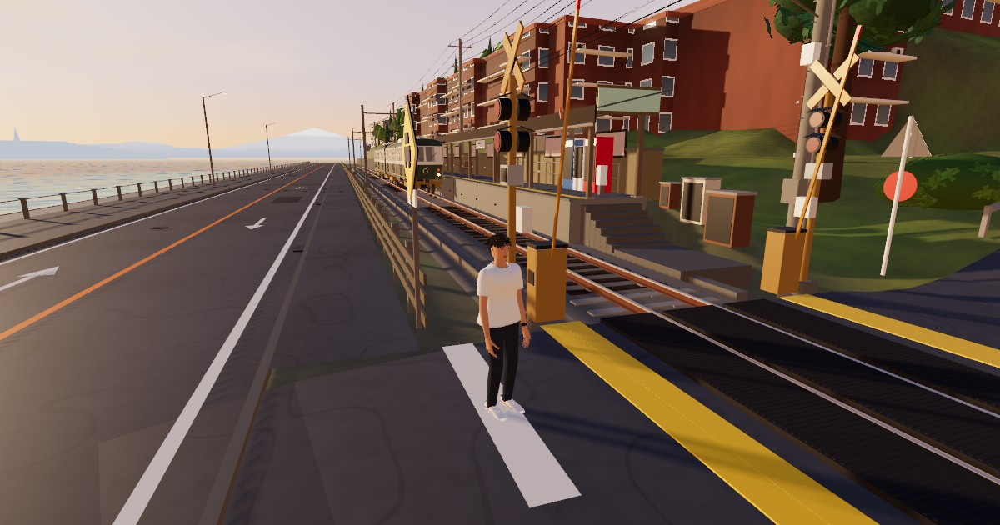

# 江ノ電 鎌倉高校前 散歩

夕暮れの江ノ電・鎌倉高校前駅の **1号踏切** と国道134号、相模湾の見える丘の街を、**人物を操作して歩き回れる** 3D ウェブアプリです（Three.js）。
踏切は電車が来ると警報が鳴り、遮断機が下り、江ノ電が走り抜けます。

**▶ 遊ぶ: https://enoden-walk.vercel.app**



## 遊び方

| 操作 | キーボード | スマホ |
| :-- | :-- | :-- |
| 移動 | `W` `A` `S` `D` / 矢印キー | 左の丸をスライド |
| 走る | `Shift` を押しながら | 「走る」ボタン |
| 全力で走る | `R` を押しながら | — |
| ジャンプ | `Space` | 「ジャンプ」ボタン |
| 視点 | ドラッグ／ホイールでズーム | 右側をドラッグ |
| 音のオン・オフ | `M` | — |

- 警報中（カンカンカン）は踏切に入れません。電車の進路に立っていると、踏切の外へ戻されます。
- 海側の歩道（国道134号のさらに南）、丘の住宅街、駅のホームなど、地形と建物の外形に沿って歩けます（建物の中・海の中には入れません）。

## 仕組み

- **フロント**: Vite + Three.js。`src/main.js`（ループ・カメラ・入力）、`player.js`（歩行・走行・ジャンプ、アニメーションの速度ブレンド）、`train.js`（電車と踏切）、`ground.js`（歩ける高さグリッド）、`world.js`（空・海・木）、`audio.js`（警報と波の音を WebAudio で合成）。
- **描画**: sRGB 出力 + ACES Filmic トーンマッピング、太陽光（`DirectionalLight`）のリアルタイムソフトシャドウ（プレイヤー追従）、空の手続きシェーダから生成した PMREM 環境マップ（`scene.environment`）でのIBL、glTF マテリアルの PBR 調整（`tunePBR`）。
- **モデル**（`public/models/`）: Blender で手続き生成したシーンを書き出したもの。
  - `world.glb`（Draco 圧縮、約 1.6 MB）: 地形・建物・線路・駅・踏切・電柱と電線・遠景
  - `train.glb`: 江ノ電 1000 形（2 両）／ `character.glb`: 20 代日本人男性（ボーン 56、Idle / Walk / Run / Sprint / Jump をベイク）
  - `ground.bin`: 1 m 格子の歩行可能な高さ（建物の外形は歩行不可）／ `trees.json`: 木の位置（インスタンス描画）／ `meta.json`
- 手続きノードのマテリアルは glTF に載らないため、書き出し時に **材質ごとの平均色 + 頂点カラー**（地形と建物）へ焼き込んでいます。見た目は「レンダー画像より簡素なローポリ調」です。

## モデルを作り直す（Blender 5.2 が必要）

```bash
# 1) 風景・電車（PLATEAU/OSM のデータは blender/plateau_data/kamakura_koko.json に焼き済み）
blender -b --python blender/enoden_kamakurakokomae.py -- --no-character --no-blend --render none --web-export public/models
# 2) 人物（ウェブ用の軽量版: 平色マテリアル・髪の房 1800 本・5 アニメ）
blender -b --python blender/character_male20s.py -- --stage anim --web-glb public/models/character.glb --out /tmp/char
npm install && npm run dev
```

`blender/fetch_plateau.py` は PLATEAU（CityGML）と OSM から `kamakura_koko.json` を作り直すスクリプトです（PLATEAU の zip から必要なタイルだけを HTTP Range で取得）。
`blender/enoden_kamakurakokomae.py` は元の高精細レンダー用のシーン生成スクリプト（`--render both` で 1920×1080 の静止画）です。

## 出典 / Credits

- 地形・建物の形状・階数: 国土交通省 **Project PLATEAU**「鎌倉市 3D 都市モデル（2024）」— [CC BY 4.0](https://creativecommons.org/licenses/by/4.0/deed.ja)
- 道路・線路・海岸線・踏切の位置: © [OpenStreetMap](https://www.openstreetmap.org/copyright) contributors — ODbL
- 電車・駅舎・踏切設備・人物・その他の 3D モデルは、上記データと写真・公開資料の目視参照をもとに Blender で手続き生成した **非公式の創作物** です。実在の鉄道会社・自治体・人物とは関係ありません。
- 外観の確認には Google ストリートビューの公式画像を目視参照しましたが、画像やそこから得たデータは本リポジトリに含めていません。

コード: MIT License（`LICENSE`）。`public/models` と `blender/plateau_data` は上記データの派生物で、それぞれのライセンスに従います。
